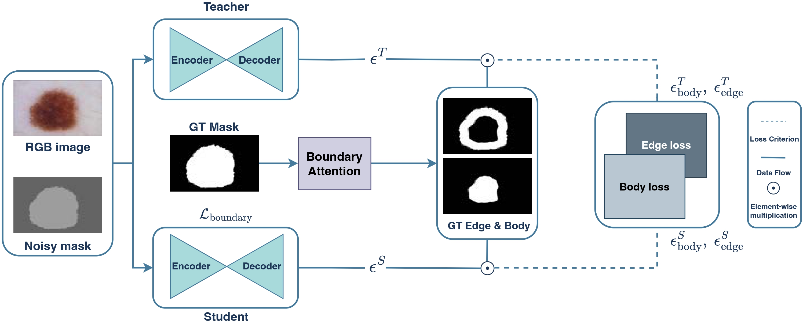

# EFKD: A Knowledge Distillation Approach for Diffusion-based Generative Skin Lesion Segmentation

This repository provides the official and fully reproducible implementation of the paper: **A Knowledge Distillation Approach for Diffusion-based Generative Skin Lesion Segmentation**

Authors: Viet-Hoang Doan, Thanh-Danh Nguyen†, Tuan-Kiet Ngo and Vinh-Tiep Nguyen.

> **Abstract:** Accurate skin lesion segmentation is crucial for early melanoma detection and reliable medical diagnosis. Recently, such generative diffusion-based segmentation models have achieved state-of-the-art performance in this task. However, their large number of parameters hinders the deployment in real-world clinical and mobile settings. A key challenge is how to compress these models while preserving their reliability in diagnosis. To this end, we propose an **edge-focused knowledge distillation (EFKD)** strategy for the generative diffusion-based skin lesion segmentation, prioritizing contour information transfer from teacher to student. Accordingly, we introduce **LiteDermoSegDiff**, a lightweight diffusion-based lesion segmentation model that integrates knowledge distillation with boundary-aware supervision. This design ensures that the student network maintains sharp lesion boundaries while significantly reducing model parameters. Extensive experiments on the common ISIC2018 and HAM10000 dermoscopic benchmarks demonstrate that our method achieves up to **88.9% parameter reduction** while maintaining competitive segmentation accuracy. These results show that diffusion-based segmentation models can be substantially compressed without compromising boundary awareness, paving the way for efficient and clinically deployable solutions in resource-constrained environments.



## Installation

This codebase is mainly built upon the original repository [DermoSegDiff](https://github.com/xmindflow/DermoSegDiff).

### Requirements

- Ubuntu 16.04 or higher 
- CUDA 11.1 or higher
- Python v3.7 or higher
- PyTorch v1.7 or higher

### Install Dependencies

```bash
# Install required packages
pip install -r requirements.txt
```

### Package List

```
albumentations==1.3.1
einops==0.6.1
ema_pytorch==0.2.3
matplotlib==3.7.2
numpy==1.24.4
opencv-python==4.6.0.66
opencv-python-headless==4.8.0.74
Pillow==10.0.0
PyYAML==6.0.1
scikit-image==0.21.0
scipy==1.10.1
termcolor==2.3.0
torch==2.0.1
torchvision==0.15.2
tqdm==4.65.0
pycocotools==2.0.7
```

## Training

### Step 1: Train Teacher Model (DermoSegDiff)

To reproduce LiteDermoSegDiff, you must first train the teacher model (DermoSegDiff):

```bash
python src/training.py -c path/to/datasets/dsd_01.yaml
```


### Step 2: Train Student Model with EFKD (LiteDermoSegDiff)

After training the teacher, proceed to train the student model using EFKD:

```bash
python src/training_kd.py -c path/to/datasets/lite.yaml
```

**Important:** Make sure that the teacher model in both config file must align.

## Testing

### Sampling & Evaluation

To test your trained model:

```bash
python src/testing.py -c configs/ham10000/dermosegdiff/dsd_01.yaml
```

For the student model:

```bash
python src/testing.py -c configs/ham10000/dermosegdiff/lite.yaml
```

### Test with Custom Checkpoint

To run with specific model weights, modify your config file at testing->model_weights->file_path and:

```bash
python src/testing.py -c /path/to/config/file
```
## Results

### Model weights

We provide the learned weights in the following. 

| Datasets | Teacher Weight | Student Weight |
|----------|----------------|----------------|
| ISIC2018 | <div align="center"><a href="https://drive.google.com/file/d/1y5rQRlCp3xHVoMHAt7QgZltyknKMWrnp/view?usp=sharing">Link</a></div> | <div align="center"><a href="https://drive.google.com/file/d/1FAumwEr8bAXLD-RmmlBQogL5T_xJxLE2/view?usp=sharing">Link</a></div> |
| HAM10000 | <div align="center"><a href="https://drive.google.com/file/d/1Fg6MAgxtb6gGA2ZNTdRGC85GNCOJkkm3/view?usp=sharing">Link</a></div> | <div align="center"><a href="https://drive.google.com/file/d/1y5rQRlCp3xHVoMHAt7QgZltyknKMWrnp/view?usp=sharing">Link</a></div> |


### Model Efficiency Comparison

| Model | Dataset | GFlops | FPS | Memory Usage (MB) |
|-------|---------|--------|-----|-------------------|
| DermoSegDiff | ISIC2018 | 1990 | 17.09 | 153.95 |
| DermoSegDiff | HAM10000 | 2556 | 17.12 | 311.55 |
| LiteDermoSegDiff | ISIC2018 | 1865 | 36.43 | 35.65 |
| LiteDermoSegDiff | HAM10000 | 2566 | 31.27 | 32.44 |

**Key Observations:**
- LiteDermoSegDiff achieves **2x faster inference** (FPS) compared to DermoSegDiff
- **76.8% reduction** in memory usage on ISIC2018 dataset
- **89.6% reduction** in memory usage on HAM10000 dataset
- Maintains comparable computational cost (GFlops) while being significantly more efficient

## Acknowledgments

This work is built upon [DermoSegDiff](https://github.com/xmindflow/DermoSegDiff). We thank the authors for their excellent work and open-source contribution.


